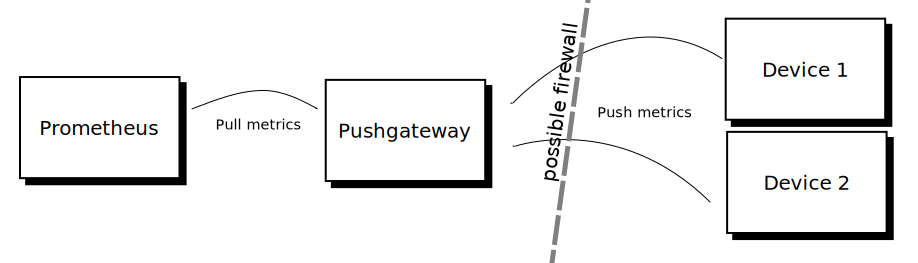

### Getting data into prometheus
- [Node exporter](https://github.com/prometheus/node_exporter)
```bash
# Check nodes you have (minikube is 1)
kubectl get nodes
NAME       STATUS    ROLES     AGE       VERSION
minikube   Ready     master    1h        v1.9.4

# Check that node-exporter daemon is launched on every node.
kubectl get daemonsets
NAME                            DESIRED   CURRENT   READY     UP-TO-DATE   AVAILABLE   NODE SELECTOR   AGE
kube-prometheus-exporter-node   1         1         1         1            1           <none>          54m
```
- [Kube state exporter](https://github.com/kubernetes/kube-state-metrics)
- [App libs](https://prometheus.io/docs/instrumenting/clientlibs/)
- [Push gateway](https://github.com/prometheus/pushgateway) (push -> pull model adapter)
  
  

### Making sure everything setup correctly
Open prometheus status page
```bash
kubectl get service | grep my-prometheus
open http://minikube_ip:prometheus_port/targets
```
Make sure everything is in state `UP`. 
During the test run I had kubelet down, unfortunately didn't find a way
to hack it during minikube bootsrap so if you do see kubelet issue:
```bash
minikube ssh
sudo su
vi /etc/systemd/system/kubelet.service.d/10-kubeadm.conf
# Append this to kubelet cmd: --authentication-token-webhook 
systemctl daemon-reload
systemctl restart kubelet
# Make sure it worked
ps aux | grep kubelet
```
With this hack it should be green.